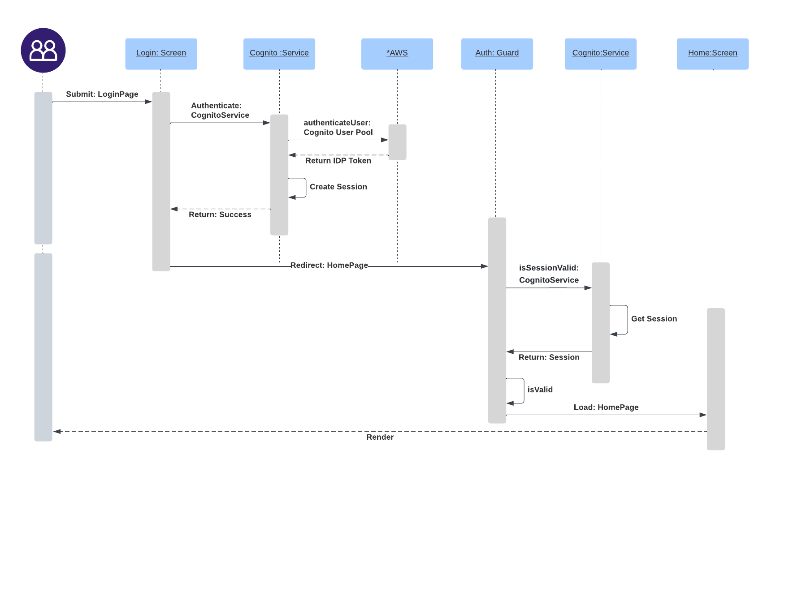

# Project I
The purpose of this application is to showcase how to manage videos from a PWA device and upload to the cloud for further analysis

## The BIG Picture
The following depicts the high-level application concept

- PWA Device: a device that the client (Project_I) application is loaded on (refer to local installation for details)
- *Screens: these are located under src/app/pages, and define the screens available to the application user
- API Server: this is hosted in AWS, managed in a separate (Project_I_API) project, and protected by Cognito (AWS managed identity provider)
- AWS: server-side services available to the client application

## Local Installation
### Pre-requisites
- Ionic: https://ionicframework.com/
- Angular: https://angular.io/
- NodeJS: https://nodejs.org/en/
### Deployment (Run in web browser)
- npm install (run first time after checking out the project)
- ionic serve

### Deployment (IOS)
- npm install (run first time after checking out the project)
- ionic capacitor run ios
- select device:
    - choose from a list of emulated devices or real devices (assuming you have one accessible/connected)

#### Troubleshoot (IOS)
- Missing Signature
    - Make sure in Xcode that you have added your team in the signing & capabilities section

### Deployment (Angular)
- TBD

## Detail Flows
This is a sequence diagram to give an example of how the authorization (happy path) works within the application
